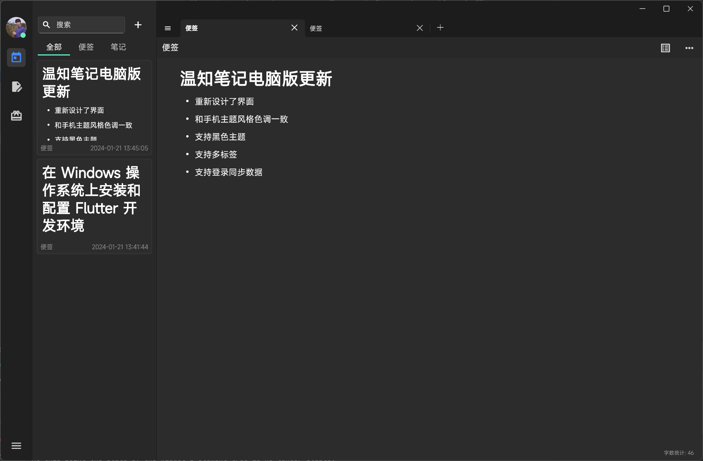
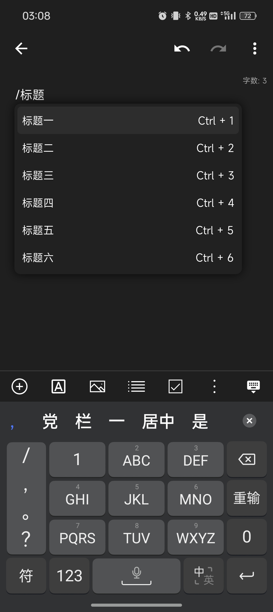
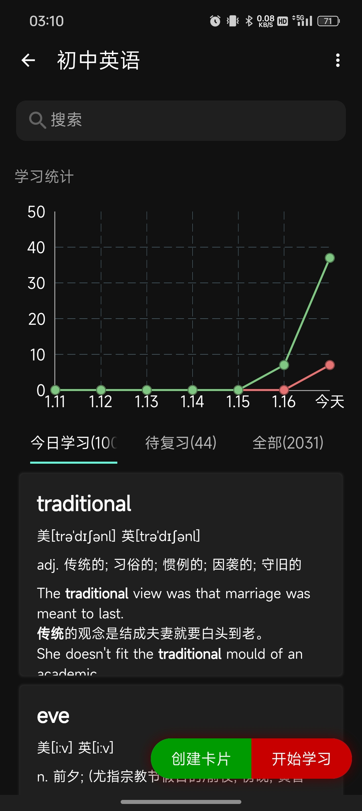

# 温知笔记
## 简介

一款跨平台的自研笔记软件，从自绘文字开始实现的高性能富文本，支持复杂元素的编辑。

目前在完善功能中，欢迎加入温知笔记交流群：568359924。

## 终身学习理念

温知笔记致力于知识记录及其学习复习的方法研究，理念是终身学习。

为何终身学习？因为只有不断地学习新的知识，复习旧的知识，将知识用于实践，才不会被时代所淘汰。

如何终身学习？温故而知新，可以为师矣。

何为故？何为新？

例如：一个公式能够解决多个题目，那么这个公式就是故，题目就是新，只有不断的去学习公式，复习公式，理解公式，才能快速解决新的问题。

温知笔记为了帮助你记住这个“公式”，做了一系列功能：便签、笔记、卡片。。。

## 电脑版界面

## 手机端界面

### 主界面

### 编辑器

### 笔记列表

### 卡片详情

### 侧滑界面

